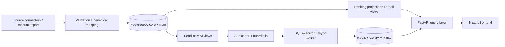
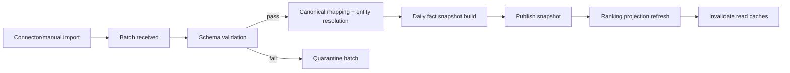
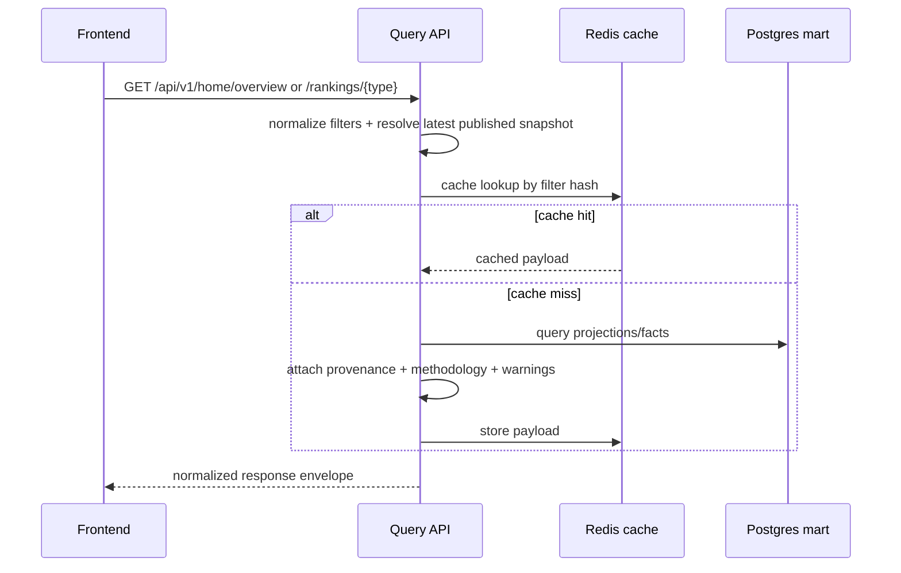
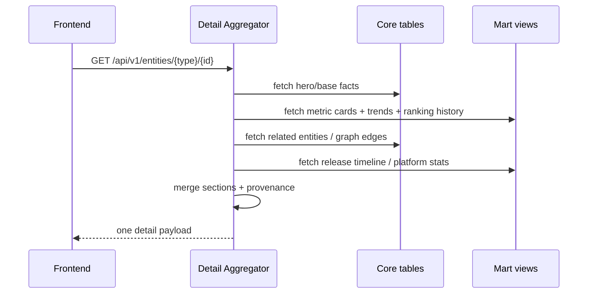
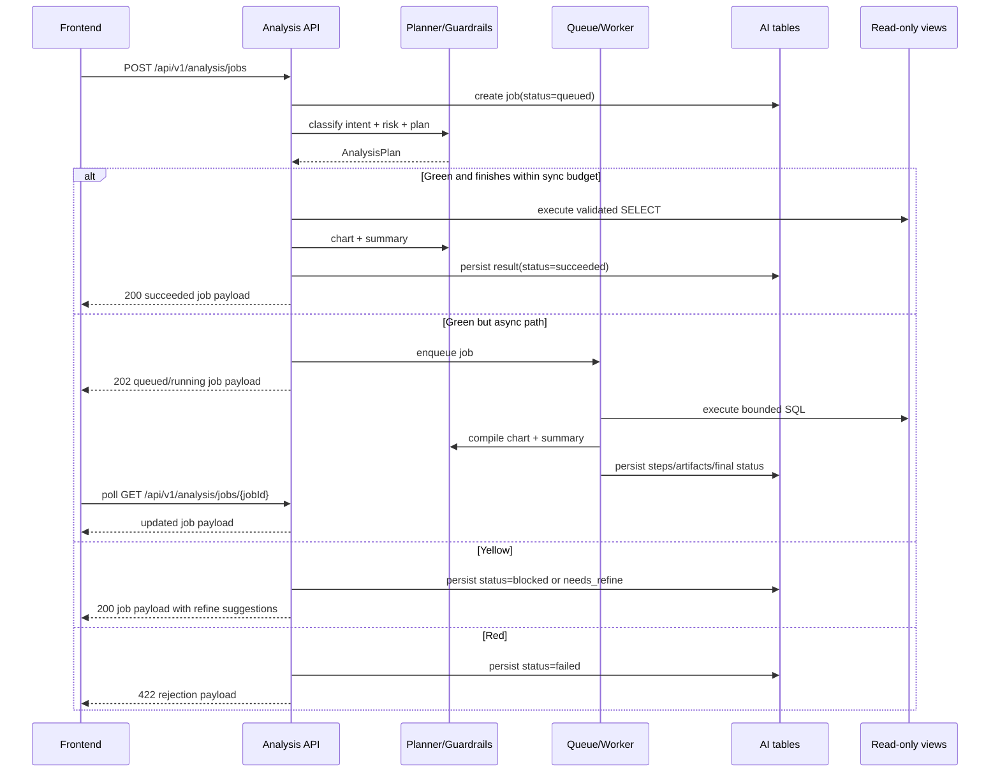
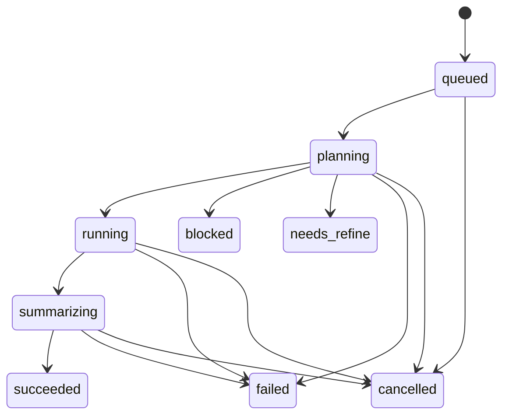

# architecture.md

Status: ready_for_parallel_implementation
Last Updated: 2026-04-01
Scope: SSBoard v1 internal prototype
Primary Inputs:
- `spec.md`
- `docs/ssboard-prd-v1.md`
- `docs/ssboard-flow-and-wireframes.html`
- `/Users/hsh/Desktop/team.md`

Important note:
- This document is aligned to `spec.md` with status `ready_for_architecture` and freezes the v1 implementation contract so frontend, backend, and AI roles can start independently.

## 1. System Overview

SSBoard is an internal web prototype for China film/TV intelligence workflows. The v1 closed loop is:

1. view homepage KPIs and four ranking previews;
2. open a ranking page and filter by date/source/platform/genre;
3. drill down into an entity detail page;
4. launch an AI analysis job from global context or entity context;
5. receive either an inline result or a tracked job state inside the same AI workbench.

The architecture is intentionally split into four stable domains:

1. **Data ingestion domain**: source connectors, manual import, validation, canonical mapping, source lineage.
2. **Read-model domain**: canonical entity tables, metric snapshots, ranking projections, detail-friendly aggregate views.
3. **Query/API domain**: homepage, rankings, entity detail, and analysis job APIs.
4. **AI analysis domain**: intent classification, Green/Yellow/Red risk grading, read-only SQL planning, chart/summary generation, and bounded async SQL execution.

### 1.1 Design decisions frozen for v1

1. **All user-facing reads come from published read models only**.
   - UI and AI never read staging/raw import tables.
   - Failed imports do not block current published reads.
2. **Rankings are projection-first, query-second**.
   - Default homepage/top-N widgets use published ranking projections.
   - Filtered ranking pages read from indexed daily metric facts/materialized views and compute rank on read, with caching.
3. **Detail pages are aggregate views, not generic CRUD**.
   - One detail endpoint returns hero facts, metric cards, trends, relations, and timeline.
4. **AI is contract-first and read-only**.
   - AI can only access whitelisted analytical views.
   - SQL is `SELECT`-only.
   - Green requests may execute directly or via bounded async SQL workers.
   - Yellow requests return refinement guidance and are not auto-executed.
   - Red requests are rejected and never execute.
5. **Every user-visible payload carries provenance**.
   - source list
   - snapshot date
   - freshness status
   - methodology references
6. **Frontend receives normalized visualization contracts**.
   - No raw SQL construction in frontend.
   - No raw ECharts options from backend/AI.
   - Backend/AI return normalized chart/table specs.

### 1.2 Non-goals for v1

- multi-tenant authorization
- editing or write-back workflows
- direct crawler control panels
- self-service schema design
- production-grade workflow approval for AI
- long-term artifact retention policies beyond prototype needs

## 2. Top-Level Context



## 3. Module Boundaries

| Module | Responsibility | Inputs | Outputs | Owner after handoff |
| --- | --- | --- | --- | --- |
| Source Connector Ingress | Pull/import TMDb/public data/manual CSV-Excel/partner export batches; register source manifests and authorization status. | API responses, files, source config | staging batches, import audit logs | backend-engineer |
| Validation & Canonical Mapping | Validate schema, normalize fields, resolve entities, attach lineage. | staging batches | canonical entities/relations, data quality results | backend-engineer |
| Snapshot Publisher | Publish canonical daily facts into queryable marts; atomically mark latest published snapshot. | canonical entities + metrics | `entity_metric_snapshots`, `release_events`, `published_snapshot_registry` | backend-engineer |
| Ranking Projector | Precompute homepage/default leaderboard projections and store ranking audit snapshots. | published daily facts | `ranking_snapshots`, top-N panels, cache invalidation events | backend-engineer |
| Filter Metadata Service | Serve bootstrap filter options and recommended AI starter questions from canonical/read models. | canonical entities + published marts | filter metadata, prompt suggestions | backend-engineer |
| Ranking Query Service | Resolve filtered ranking pages from published metric facts/materialized views; add methodology, trend, and source breakdown. | ranking query params + published marts | ranking API payloads | backend-engineer |
| Entity Detail Aggregator | Assemble one entity detail bundle: hero facts, cards, trend, ranking history, relationships, timeline, provenance. | entity id/type + published marts + core relations | detail API payloads | backend-engineer |
| Analysis Orchestrator API | Accept AI questions, persist jobs, dispatch inline/async execution, expose polling/cancel/list APIs. | analysis requests | job records, status updates, API payloads | backend-engineer |
| Analysis Planner & Guardrails | Classify intent, assess Green/Yellow/Red risk, produce read-only SQL plans when allowed, validate against whitelist, and generate refinement/rejection guidance when not allowed. | question + context + whitelist views | `AnalysisPlan`, guardrail decisions | ai-engineer |
| Analysis Executors | Run Green SQL inline or bounded async SQL execution; compile chart/table/summary artifacts. | analysis plan + read-only views | `AnalysisResult`, artifacts, step logs | ai-engineer |
| Artifact Store & Audit | Persist result artifacts, SQL explanation, execution trace, blocked/rejection reasons, and retry/failure metadata. | analysis execution output | object references + DB audit rows | backend-engineer + ai-engineer |
| Frontend Presentation | Render homepage, rankings, detail, AI workbench, polling/cancel/error states. | OpenAPI payloads only | UI pages and interactions | frontend-engineer |

### 3.1 Boundary rules that must not change during implementation

1. Frontend never computes official ranking scores and never builds SQL.
2. Ranking APIs never read staging/raw import tables.
3. Entity detail aggregation is a dedicated service boundary; frontend must not fan out to many undocumented endpoints.
4. AI planner/executor can only query whitelisted analytical views, never mutable tables.
5. Async workers only run bounded read-only SQL workloads. The API process must not run long custom script analysis directly.
6. All terminal AI job states must be persisted before the API reports them.

## 4. Persistence and Read-Model Contract

### 4.1 Storage layers

| Layer | Schema/table family | Purpose |
| --- | --- | --- |
| `staging` | raw import batches and parsed records | isolate connector/manual import volatility |
| `core` | `works`, `persons`, `characters`, `platforms`, `sources`, relationship tables | canonical master data |
| `mart` | `entity_metric_snapshots`, `ranking_snapshots`, `release_events`, materialized read views | read-optimized analytical facts |
| `ai` | `analysis_jobs`, `analysis_job_steps`, `analysis_artifacts`, `analysis_audit_logs` | analysis orchestration and audit |

### 4.2 Required canonical entities

- `works`
  - movie or series
- `persons`
  - actor / director / writer / other role members needed by detail pages
- `characters`
- `platforms`
- `sources`
- relationship tables
  - `work_person_credits`
  - `character_castings`
  - `work_platform_releases`
- fact tables
  - `entity_metric_snapshots`
  - `ranking_snapshots`
  - `release_events`
  - `analysis_jobs`
  - `analysis_artifacts`

### 4.3 Read-model invariants

1. `entity_metric_snapshots` is the canonical daily fact source for filtered ranking pages, detail trend charts, and AI read-only analysis.
2. `ranking_snapshots` is the canonical source for homepage ranking widgets and ranking audit trails.
3. `published_snapshot_registry` is the switchboard for data freshness.
   - UI defaults to the latest `published` snapshot for each ranking type.
4. All mart rows must carry:
   - `snapshot_date`
   - `source_id`
   - `authorization_status`
   - `ingested_at` / `published_at`
5. AI reads only from whitelisted views built on `mart` and selected `core` joins, for example:
   - `ai_read_rankings`
   - `ai_read_entity_metrics`
   - `ai_read_release_events`
   - `ai_read_entity_relations`

### 4.4 Publication rule

New ingested data is invisible to UI/AI until a publish step marks the snapshot as current. This guarantees:

- partial imports do not leak into ranking pages;
- provenance always points to a published snapshot id;
- cache invalidation happens on publish, not on raw import.

## 5. Data Flows

### 5.1 Ingestion flow



**Ingestion batch states**

- `received`
- `validated`
- `normalized`
- `published`
- `quarantined`
- `failed`

**Rules**

- validation/data quality errors lead to `quarantined`, not automatic retry;
- transient source/network failures are retryable;
- read APIs always serve the latest successful `published` snapshot.

### 5.2 Homepage and ranking read flow



**Ranking query contract**

- Default scope (homepage/top-N) prefers `ranking_snapshots`.
- Filtered ranking pages use indexed mart views/facts with window ranking on read.
- API returns both list items and right-side analytical panels from the same normalized response.

### 5.3 Entity detail aggregation flow



**Detail aggregation contract**

- One endpoint returns the full page contract.
- Section-level failures should degrade to warnings/empty sections when safe, not whole-page failure, unless hero entity lookup itself fails.
- Shared normalized chart schema is reused for trend panels and AI result panels.

### 5.4 AI analysis flow



## 6. External API Contract Principles

The detailed path/schema contract lives in `api-contract.yaml`. These principles are frozen here for implementation alignment.

### 6.1 Public v1 endpoints

- `GET /api/v1/bootstrap/filters`
- `GET /api/v1/home/overview`
- `GET /api/v1/rankings/{rankingType}`
- `GET /api/v1/entities/{entityType}/{entityId}`
- `GET /api/v1/analysis/jobs`
- `POST /api/v1/analysis/jobs`
- `GET /api/v1/analysis/jobs/{jobId}`
- `POST /api/v1/analysis/jobs/{jobId}/cancel`

### 6.2 Response envelope

All success responses follow:

```json
{
  "data": {"...": "domain payload"},
  "meta": {
    "request_id": "uuid",
    "generated_at": "2026-04-01T10:00:00Z",
    "warnings": [],
    "pagination": null
  }
}
```

All error responses follow:

```json
{
  "error": {
    "code": "ENTITY_NOT_FOUND",
    "message": "Requested work was not found.",
    "details": {},
    "retryable": false,
    "hint": "Verify the entity type and id from the ranking/detail navigation context."
  },
  "meta": {
    "request_id": "uuid",
    "generated_at": "2026-04-01T10:00:00Z",
    "warnings": []
  }
}
```

### 6.3 Provenance block

Every homepage/ranking/detail/analysis result that renders data must expose:

- `snapshot_id`
- `snapshot_date`
- `refreshed_at`
- `freshness_status`
- `sources[]`
- `methodology_refs[]`

This is mandatory because “来源 + 更新时间 + 口径说明” is a hard business requirement.

## 7. Internal Service Contracts

These internal contracts are frozen even though they are not public HTTP APIs.

### 7.1 Ranking query service

**Input**
- ranking type: `artists | characters | series | movies`
- normalized filter set:
  - `as_of`
  - `window`
  - `source_ids[]`
  - `platform_ids[]`
  - `genres[]`
  - paging/sort

**Output**
- ranking items
- trend/source-breakdown panels
- provenance block
- applied filter echo

**Hard rule**
- If the requested `as_of` is missing, service falls back to latest published snapshot and adds warning `AS_OF_FALLBACK_APPLIED`.

### 7.2 Entity detail aggregator

**Input**
- `entity_type`
- `entity_id`
- `as_of`
- `trend_window`

**Output sections**
- `entity`
- `hero_facts[]`
- `metric_cards[]`
- `trend_panels[]`
- `ranking_history[]`
- `related_groups[]`
- `timeline[]`
- `provenance`

**Hard rule**
- If the entity is missing, fail fast with `404 ENTITY_NOT_FOUND`.
- If one subordinate section fails but hero/base entity exists, return `200` with empty section + warning, unless the failed section is required by page shell (`entity`, `provenance`).

### 7.3 Analysis planner contract

`AnalysisPlan` must contain at least:

- `intent`
- `risk_level` (`green | yellow | red`)
- `execution_mode`
- `sql_text` (nullable for blocked/rejected plans)
- `sql_explanation`
- `guardrail_summary`
- `data_scope`
- `recommended_visualization`
- `risk_reason`
- `refine_suggestions[]`

**Hard rules**

1. `sql_text` must be `SELECT`-only.
2. Referenced relations must come from the whitelist view registry.
3. Yellow plans never auto-execute; they end as `blocked` or `needs_refine` with concrete narrowing guidance.
4. Red plans end with `failed` + `GUARDRAIL_REJECTED` or equivalent refusal code; no worker retry.
5. AI planner returns normalized visualization hints, not frontend library config.

### 7.4 Analysis result contract

`AnalysisResult` must contain at least:

- `summary_markdown`
- `chart`
- `table_preview`
- `artifacts[]`
- `provenance`

`summary_markdown` may be absent only if the job fails before summarization. In success cases it is mandatory.

## 8. Async Analysis Job State Machine

### 8.1 State definitions

| State | Meaning | Terminal |
| --- | --- | --- |
| `queued` | Job accepted and persisted; waiting for planner/worker claim. | no |
| `planning` | Intent classification, risk grading, and read-only SQL plan generation. | no |
| `running` | Read-only SQL execution currently executing. | no |
| `summarizing` | Chart/table packaging and Chinese summary generation. | no |
| `blocked` | Yellow request halted pending question refinement; no SQL executed. | yes |
| `needs_refine` | Yellow request halted with narrower suggested scope; no SQL executed. | yes |
| `succeeded` | Final result persisted and ready to render/export. | yes |
| `failed` | Terminal failure with machine-readable error. | yes |
| `cancelled` | User/system cancelled before terminal success. | yes |

### 8.2 Allowed transitions



### 8.3 Transition rules

1. Every analysis request creates a persisted job row before planning begins.
2. Green sync execution still uses the same state machine; it just reaches `succeeded` within the request budget.
3. `cancelled` is best-effort:
   - guaranteed before worker claim;
   - cooperative during `running`/`summarizing` via cancellation token checks.
4. No terminal-to-nonterminal transition is allowed.
5. Results become immutable once `succeeded`.
6. A cancelled job must not produce new visible artifacts after the terminal state is written.

### 8.4 Retry semantics

| Failure class | Example code | Retry policy | Final state if retries exhausted |
| --- | --- | --- | --- |
| Transient infrastructure | `WAREHOUSE_TIMEOUT`, `QUEUE_BACKEND_UNAVAILABLE` | worker retries up to 2 times with backoff | `failed` |
| Yellow scope/ambiguity | `QUESTION_TOO_BROAD`, `RESULT_TOO_LARGE`, `AMBIGUOUS_SCOPE` | no auto retry; return refine suggestions | `blocked` or `needs_refine` |
| Guardrail / policy rejection | `GUARDRAIL_REJECTED`, `UNSUPPORTED_ANALYSIS_INTENT` | no retry | `failed` |
| Data not found / empty result | `NO_DATA_IN_SCOPE` | no retry; return readable message | `failed` |
| User cancellation | `CANCELLED_BY_USER` | no retry | `cancelled` |

## 9. Error Model and Warning Semantics

### 9.1 HTTP and machine codes

| HTTP | Code examples | Meaning |
| --- | --- | --- |
| 400 | `INVALID_FILTER`, `INVALID_PAGINATION` | malformed request |
| 404 | `ENTITY_NOT_FOUND`, `JOB_NOT_FOUND` | resource missing |
| 409 | `JOB_NOT_CANCELLABLE` | legal state conflict |
| 422 | `UNSUPPORTED_ANALYSIS_INTENT`, `GUARDRAIL_REJECTED` | request understood but not executable |
| 429 | `ANALYSIS_QUEUE_SATURATED` | temporary throttling |
| 500 | `INTERNAL_ERROR` | unexpected server-side failure |
| 503 | `DEPENDENCY_UNAVAILABLE` | warehouse/queue/object storage unavailable |

### 9.2 Warning codes that do not fail the request

- `AS_OF_FALLBACK_APPLIED`
- `STALE_DATA`
- `PARTIAL_SECTION_UNAVAILABLE`
- `ROW_LIMIT_TRUNCATED`
- `PARTIAL_SOURCE_COVERAGE`
- `SUMMARY_DEGRADED`
- `MULTI_SOURCE_AGGREGATED`

Warnings must live in `meta.warnings[]` and never replace the main payload when the response is otherwise renderable.

## 10. Caching and Freshness

| Surface | Source | Cache strategy |
| --- | --- | --- |
| Bootstrap filters | core + snapshot registry | 5 min TTL |
| Homepage overview | ranking projections + mart | 60 sec TTL keyed by filter hash |
| Ranking page | mart/materialized view | 60 sec TTL keyed by full query hash |
| Entity detail | core + mart aggregate | 120 sec TTL keyed by entity/as_of/window |
| Analysis jobs | DB source of truth | no response caching for mutable states |

Freshness classification:

- `fresh`: published within expected SLA
- `delayed`: published but lagging behind SLA
- `stale`: latest published snapshot older than acceptable threshold
- `unknown`: freshness cannot be computed

## 11. Parallel Implementation Handoff

### 11.1 Frontend-engineer can start with

- the path/schema contract in `api-contract.yaml`
- normalized `ChartSpec`, `TablePreview`, `AnalysisJob` polling contract
- page-level assumptions:
  - homepage consumes one overview payload
  - ranking page consumes one ranking payload
  - detail page consumes one detail payload
  - AI workbench uses create/list/get/cancel job endpoints

### 11.2 Backend-engineer can start with

- module boundaries in sections 3 to 5
- persistence layers in section 4
- job state machine in section 8
- shared error/warning model in section 9

### 11.3 AI-engineer can start with

- `AnalysisPlan` and `AnalysisResult` contract in section 7
- whitelist-only read rules
- execution mode rules:
  - `sync_sql`
  - `async_sql`
- terminal error semantics and retry policy in section 8.4

## 12. Open Risks

1. `spec.md` is still not backfilled; contract is currently anchored to PRD + wireframes.
2. Data source availability and authorization quality may delay real ingestion; mock/published sample snapshots should be prepared early.
3. Ranking methodology definitions still need explicit business naming/weights per ranking type, but the response contract already reserves methodology references so implementation can proceed.
4. AI quality depends on the design of whitelist analytical views; poor view design will hurt NL2SQL even if the API contract is correct.
5. `spec.md` explicitly defers global search and complex relationship graphs to later phases, so implementation should not reintroduce them through side channels.
