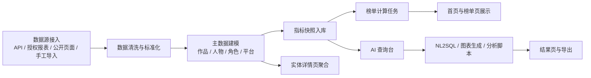

# SSBoard PRD v1

## 1. 文档信息

- 项目名称：SSBoard 中国影视行业数据统计与分析看板平台
- 文档版本：v1.0
- 文档日期：2026-03-31
- 文档状态：待评审
- 参考输入：
  - 白板草图：艺人热榜、角色热榜、剧集热榜、电影热榜、云合入口
  - 竞品资料：[GitHub_开源数据分析看板项目_TOP10_2026-03-31.md](/Users/hsh/Desktop/GitHub_开源数据分析看板项目_TOP10_2026-03-31.md)

## 2. 项目背景

中国影视行业的数据分散在票房平台、内容平台、公开公示、行业报告和人工表格中，团队在做选题、宣发、艺人观察、竞品分析时，经常需要跨平台搬运数据、手工对表和临时出图，效率低、口径不统一。

本项目希望先建设一个内部原型平台，围绕四类核心榜单搭建一套“数据汇聚 + 榜单计算 + 智能分析 + 图表展示”的可扩展体系，为后续接入更多行业数据、自然语言分析和算法洞察打基础。

## 3. 产品目标

### 3.1 业务目标

1. 在一个平台内集中查看中国影视行业核心榜单。
2. 支持按时间、平台、题材、来源筛选和对比数据。
3. 支持通过自然语言检索行业数据，并自动生成图表与解释。
4. 为后续接入授权数据源、行业模型和机器学习算法预留标准接口。

### 3.2 v1 成功标准

1. 四类榜单可稳定展示：艺人、角色、剧集、电影。
2. 数据可追溯到来源与日期，榜单口径清晰。
3. 支持至少一种自然语言到 SQL 的只读查询链路。
4. 用户能够在 3 分钟内完成一次“查看榜单 -> 下钻详情 -> 发起 AI 分析”的完整流程。

## 4. 产品定位

- 产品阶段：内部原型
- 使用对象：
  - 内容策划与研究团队
  - 宣发与市场团队
  - 投资、行业分析与业务负责人
- 产品类型：垂直行业数据看板，而不是通用 BI 工具
- 首发范围：四类核心榜单 + 实体详情 + AI 查询台

## 5. 用户角色

| 角色 | 典型目标 | 核心需求 |
| --- | --- | --- |
| 行业分析师 | 快速输出对比报告 | 统一数据口径、趋势图、导出能力 |
| 宣发同学 | 观察竞品与演员热度 | 榜单波动、题材与平台对比 |
| 内容策划 | 做选题与阵容判断 | 剧集热度、角色关注度、艺人关联 |
| 管理层 | 看大盘与异常变化 | 首页 KPI、周报视角、自动分析摘要 |

## 6. 核心问题

1. 数据来源分散，人工整理成本高。
2. 榜单更新频率和统计口径不一致。
3. 临时报表多，重复出图效率低。
4. 想问复杂问题时，需要分析师手写 SQL 和 Python。

## 7. 方案概述

平台采用“三层架构”：

1. 数据层：接入 API、公开页面、人工导入和授权数据。
2. 服务层：完成清洗、建模、榜单计算、缓存、AI 查询和任务调度。
3. 展示层：提供首页看板、排行榜、详情页、AI 查询台与图表结果页。

## 8. 业务流程

## 9. 功能范围

### 9.1 v1 必做

1. 首页总览
2. 四类榜单页
3. 实体详情页
4. 多条件筛选
5. 趋势图与分布图
6. AI 查询台
7. 异步分析任务与结果页
8. 数据来源与更新时间展示

### 9.2 v1 不做

1. 多租户
2. 支付系统
3. 复杂权限体系
4. 大规模用户行为埋点分析
5. 自动化多模态视频理解
6. 未授权商业平台的高风险抓取

## 10. 页面设计

### 10.1 首页

- 顶部：Logo、全局搜索、时间选择、来源筛选、题材筛选
- KPI 区：作品总数、上新数量、热度涨幅冠军、数据覆盖率
- 榜单区：艺人热榜、角色热榜、剧集热榜、电影热榜
- 分析区：趋势图、题材分布、平台对比
- AI 区：自然语言输入、推荐问题、最近分析任务

### 10.2 榜单页

- 左侧筛选栏：时间、平台、类型、来源、排序
- 中部榜单表：排名、名称、分值、涨跌、标签
- 右侧图表：趋势对比、来源拆解

### 10.3 详情页

- 作品详情：基础信息、热度走势、演员阵容、角色关系、平台信息
- 艺人详情：代表作品、近期热度、合作关系图
- 角色详情：所属作品、饰演者、角色趋势

### 10.4 AI 查询台

- 查询输入区：自然语言问题
- SQL 解释区：生成逻辑、风险等级、数据范围
- 结果图区：自动图表 + 指标卡
- 结果说明区：中文分析摘要

## 11. 数据策略

### 11.1 数据来源优先级

1. 官方/开放 API 与公开公示
2. 授权商业数据或合作方导出
3. 人工导入 CSV/Excel
4. 合规前提下的受控采集

### 11.2 v1 建议接入数据

1. TMDb：电影、剧集、人物元数据
2. 广电及地方公开公示数据：备案、题材、公开统计
3. 手工导入：猫眼、灯塔、云合、艺恩等合作或导出数据

### 11.3 合规要求

1. 数据来源必须记录采集方式、授权状态和更新时间。
2. 未获得授权的商业平台数据不得作为自动抓取主方案。
3. AI 只允许访问只读分析视图，不直接访问底层写表。

## 12. 数据模型

### 12.1 主实体

- works：电影、剧集
- persons：艺人、导演、编剧等
- characters：角色
- platforms：院线、电视台、流媒体平台
- sources：数据来源

### 12.2 关系实体

- work_person_credits：作品与人物多对多
- character_castings：角色与饰演者多对多
- work_platform_releases：作品与平台关系

### 12.3 事实数据

- entity_metric_snapshots：实体日维度指标快照
- ranking_snapshots：榜单快照
- release_events：上映、开播、定档等事件
- ai_queries / analysis_jobs / analysis_artifacts：AI 分析与产出

## 13. AI 能力设计

### 13.1 v1 AI 范围

1. 自然语言转只读 SQL
2. 自动选择适合的图表
3. 生成简短中文分析摘要
4. 支持低风险自动执行
5. 高风险脚本进入异步任务

### 13.2 安全策略

1. 仅允许 `SELECT` 语句
2. 仅允许访问白名单视图
3. 限制返回行数、执行时长和资源消耗
4. Python 分析脚本运行在隔离容器中
5. 所有 AI 结果保留审计日志

## 14. 非功能要求

### 14.1 性能

1. 首页和榜单页首屏接口响应目标 < 1.5 秒
2. AI 低风险查询目标 < 10 秒返回图表
3. 长时分析任务进入异步队列并显示状态

### 14.2 可用性

1. 榜单页必须清楚显示“更新时间”和“来源”
2. 数据缺失时提供空状态说明
3. 任务失败时返回可读错误和重试入口

### 14.3 可扩展性

1. 榜单类型可配置扩展
2. 数据源可通过 connector 方式接入
3. AI 能力支持切换模型与策略

## 15. 技术架构建议

### 15.1 技术选型

- 前端：Next.js + TypeScript + Tailwind CSS + ECharts
- 后端：FastAPI + Pydantic + SQLAlchemy
- 数据库：PostgreSQL
- 任务队列：Celery + Redis
- 对象存储：MinIO
- 容器化：Docker Compose

### 15.2 开发顺序

1. 先定义数据模型、API 合同和样例数据
2. 前端基于 mock 数据并行画页面
3. 后端补真实数据链路和异步任务
4. 最后联调 AI 查询台与脚本执行

## 16. 实施里程碑

| 阶段 | 周期 | 目标 |
| --- | --- | --- |
| M1 | 第 1 周 | 脚手架、PRD、设计稿、数据库初版、mock API |
| M2 | 第 2 周 | 四类榜单真实数据导入、首页与榜单页 |
| M3 | 第 3 周 | 详情页、趋势图、来源管理、缓存 |
| M4 | 第 4 周 | AI 查询台、NL2SQL、图表自动生成 |
| M5 | 第 5 周 | 分析脚本沙箱、异常检测、导出与内部试用 |

## 17. 验收标准

1. 可查看四类榜单，并按日期与来源过滤。
2. 可进入至少 3 类详情页并查看趋势图。
3. 可输入自然语言问题并拿到可解释的图表结果。
4. 所有榜单记录可追溯到来源和快照时间。
5. 高风险 AI 任务不会在主服务中直接执行。

## 18. 风险与应对

| 风险 | 说明 | 应对方式 |
| --- | --- | --- |
| 数据授权风险 | 商业平台数据抓取风险高 | 以授权、导出和手工导入为主 |
| 口径不一致 | 不同来源指标定义不同 | 建立指标映射与口径说明 |
| AI 幻觉 | SQL 或结论可能出错 | 只读白名单视图 + 风险分级 |
| 长任务阻塞 | 分析脚本耗时长 | 异步队列 + 状态页 |

## 19. 附件

- 视觉与原型文件：[ssboard-flow-and-wireframes.html](/Users/hsh/Desktop/ssboard/docs/ssboard-flow-and-wireframes.html)
